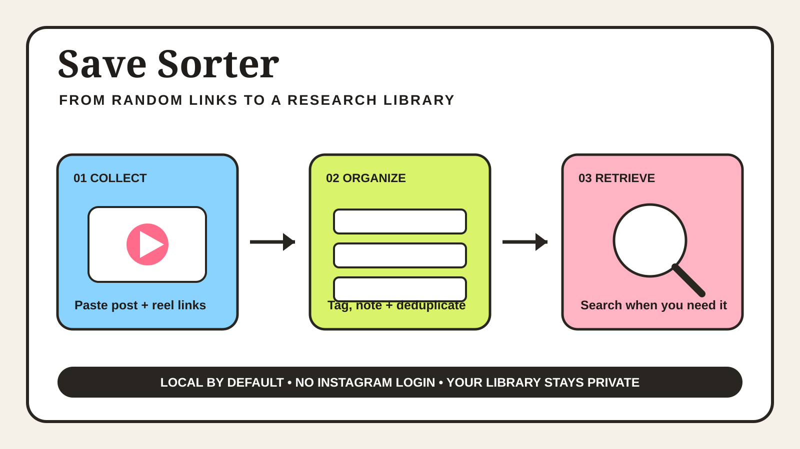

# 📌 Save Sorter



**Turn the Instagram posts you keep sending yourself into a private, searchable research library.**

I save good hooks, formats, ads, carousels, and visual ideas constantly. The problem is that saving is easy and finding the right reference again is not. Useful posts disappear into one endless folder with no context for *why* I saved them.

Save Sorter gives each reference a note, tags, and a status, then builds a visual inbox you can search when you are writing a brief or planning a campaign.

## What it does

1. **Collect** individual Instagram post or reel links, or import many links from a text, CSV, or JSON file.
2. **Organize** them with your own title, creator, note, tags, and status.
3. **Deduplicate** repeated links automatically.
4. **Render** a local visual library with search, tag filters, and status filters.

Your real library is ignored by Git by default. The repository contains fictional demo data only.

## Why I built it

Marketers do not usually need more inspiration. We need to retrieve the *right* inspiration at the moment we are making a decision.

The difference between a random saved post and a useful reference is context:

- What caught my attention?
- Was it the hook, visual treatment, proof, format, or offer?
- Where could I test the pattern?
- Have I already used it?

Save Sorter preserves that thinking next to the link.

## Quick start

You need [Node.js 20+](https://nodejs.org/). The tool has no third-party packages.

```bash
git clone https://github.com/YOUR-USERNAME/instagram-saves-organizer.git
cd instagram-saves-organizer
npm test
```

Add one reference:

```bash
node cli.js add "https://www.instagram.com/reel/SHORTCODE/" \
  --title "Strong problem-first opening" \
  --creator "creator_handle" \
  --note "The product appears before the explanation" \
  --tags "hooks,visual storytelling"
```

Or put multiple links in a `.txt`, `.csv`, or `.json` file and import them:

```bash
node cli.js import my-links.txt
```

Build the searchable library:

```bash
node cli.js render
```

Open `inbox.html` in your browser. To see the fictional demo first, run:

```bash
npm run demo
```

Then open `demo/inbox.html`.

## Privacy and limitations

This project deliberately **does not log in to Instagram, scrape saved posts, store cookies, or bypass platform restrictions**. It organizes links that you choose to provide.

It also does not download or copy creators' media. Each card links back to the original Instagram post.

## Project structure

```text
├── cli.js                 # add, import, render, and demo commands
├── src/                   # URL validation, import, storage, and rendering
├── examples/              # fictional data safe to publish
├── assets/                # GitHub cover and workflow visual
└── test/                  # built-in Node tests
```

## Who this is for

Content strategists, creative strategists, social media teams, and anyone whose Instagram saves have become a graveyard of good ideas.

## Built by

[Vishnupriya Jha](https://github.com/vishnupriyajha2026), a marketing strategist who turns repeated research and creative work into practical AI-assisted systems.
